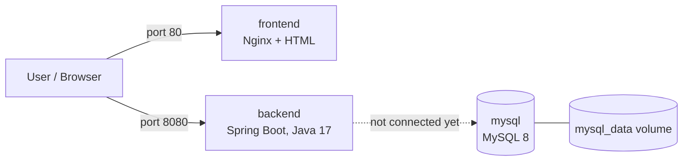

# docker-compose-springboot-ec2

A multi-container application built with **Docker** and **Docker Compose** and deployed on **AWS EC2**: an Nginx frontend, a Spring Boot backend and a MySQL database.

> Built as part of my DevOps training.

## Architecture



All three services run on one Docker Compose network. MySQL is not published to the host, so it is reachable only from the other containers.

## Services

| Service | Image / build | Port | What it does |
|---|---|---|---|
| frontend | Nginx, built from `frontend/` | 80 | Serves a static HTML page |
| backend | Spring Boot 3, multi-stage build from `backend/backend/` | 8080 | REST endpoint `/` returns "Backend Running Successfully" |
| mysql | `mysql:8` | internal only | Database with a persistent named volume |

**Current status:** the backend does not talk to MySQL yet. The database container runs and persists data, and wiring the backend to it is listed under improvements.

## Project structure

```
docker-compose-springboot-ec2/
├── docker-compose.yml
├── .env.example
├── .gitignore
├── frontend/
│   ├── Dockerfile
│   └── index.html
└── backend/backend/
    ├── Dockerfile          # multi-stage: Maven build, then slim JRE image
    ├── pom.xml
    └── src/
```

## Run it locally

Requirements: Docker with the Compose plugin.

```bash
git clone https://github.com/shravan16112004/docker-compose-springboot-ec2.git
cd docker-compose-springboot-ec2

cp .env.example .env
# edit .env and set your own MYSQL_ROOT_PASSWORD

docker compose up -d --build
docker compose ps
```

Test it:

```bash
curl localhost:80      # HTML page
curl localhost:8080    # Backend Running Successfully
```

The backend takes 15-30 seconds to start on a small machine, so wait a moment if the first request fails.

Stop everything:

```bash
docker compose down
```

## Deploy on AWS EC2

1. Launch an EC2 instance (Ubuntu) and install Docker and the Compose plugin.
2. In the security group, allow inbound **22** (SSH, from your IP only), **80** and **8080**. Do not open 3306.
3. Clone this repo on the instance, create `.env` from `.env.example`, and run `docker compose up -d --build`.
4. Open `http://<EC2-public-IP>` in a browser.

## Screenshots

Add to a `docs/` folder and link here (blur account IDs and IPs):

- Containers running (`docker compose ps`)
- Frontend page in the browser
- Backend response
- EC2 instance and security group

## What I learned

- Writing Dockerfiles for a static Nginx site and a Spring Boot app
- Multi-stage builds, so the image builds from source and does not depend on a local `target/` folder
- Running several services with Docker Compose and keeping secrets in a `.env` file instead of the code
- Not publishing the database port, so the database is not exposed to the internet
- Deploying a Compose stack on EC2 and opening only the required ports

## Possible improvements

- Connect the backend to MySQL with Spring Data JPA and a driver, using credentials from environment variables
- Add a health check and `depends_on` with `condition: service_healthy`
- Pin the Nginx image version instead of `latest`
- Run the stack behind a reverse proxy and add HTTPS
